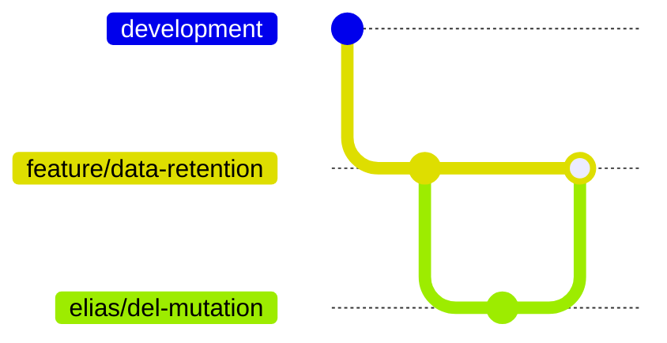

# Branching

Always `git pull` to ensure you're branching from the latest commit of your upstream "base" branches.

Unless told otherwise, when first starting feature work (ie: you're implementing `plan.md`), always create and push a base `feature/` branch before continuing. Treat this feature branch as your "base" branch for all future sub-branches and PRs from milestones and subsequent plan iterations (`plan.N.md`).

Following initial base branch rules, with every plan, always use git worktrees to create working branches. Create them in the `.worktrees` directory of a repository. Name working branches with the user's name, like `elias/`, fetched via MCP, followed by a unique hyphenated slug. When following a plan, the slug must correspond to the plan name.

## Expected git tree layout for a feature

